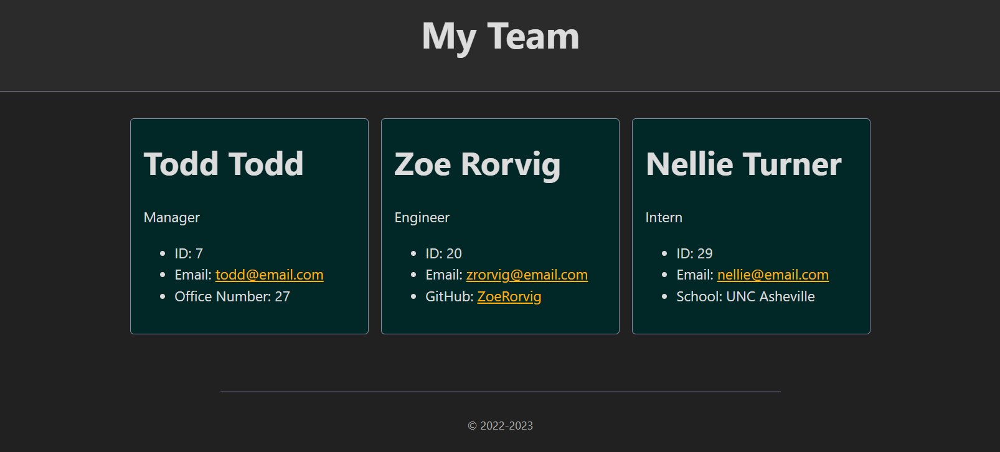

# Team Profile Generator

## Table of Contents
- [Description](#description)
- [Instructions](#instructions)
- [License](#license)
- [Visuals](#visuals)

## Description 
This application produces an HTML file containing a basic profile for your team.

Features Include:
- Prompts to enter information for a Manager, Engineers, and Interns.
- Manager's information includes their name, employee id, email, and office number. 
- Engineer's information includes their name, employee id, email, and GitHub username. 
- Intern's information includes their name, employee id, email, and school name. 
- GitHub usernames are linked to their respective GitHub pages and will open in a separate tab. 
- Emails are linked and will open in the users default emailing program, populating the TO field with the address.
- This program produces an HTML file that can be opened in the browser. 
- The program requires inputs from the user for each prompt given. 

## Instructions
- Enter "node index.js" into the command terminal to run the program.
- Follow the prompts to enter information.
- Select "Finished Building my Team" to close out of the prompts and generate the HTML file. 

## License
To get more information for this license, please see [MIT](https://opensource.org/licenses/MIT)!

## Visuals 

The following is a link to a video demonstration of the program:

[Team Profile Generator Demonstration](https://drive.google.com/file/d/135p-RFDAz1qsPyYY5B7Rmc8PKc9yFgGt/view)

The following is a screenshot of an example team profile:

